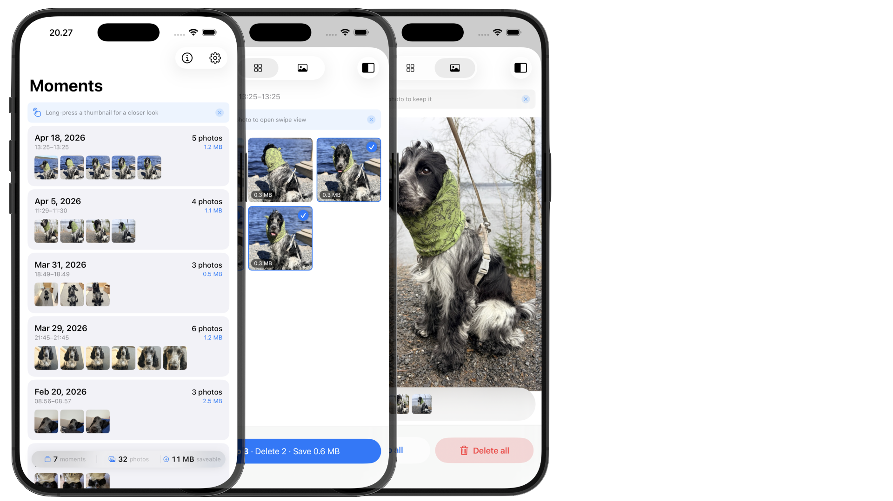

# Pickr.

> The fastest way to clear burst shots and near-duplicates from your iPhone camera roll. 100% on-device.

Pickr. groups near-duplicate photos by when they were taken, lets you tap the keepers, and sends the rest to Recently Deleted in one action. No accounts, no cloud, no AI.

**App Store:** *coming soon*
**Requires:** iPhone running iOS 18 or later.

---

## How it works

1. Pickr. scans your photo library using EXIF timestamps.
2. Photos taken within a short window (default: 1 minute) are grouped as a **moment**.
3. You tap the ones you want to keep. Everything unselected is queued for deletion.
4. Confirming moves the rest to the system **Recently Deleted** album — reversible for 30 days.

No photos, metadata, or identifiers ever leave your device.

## Features

- Swipe a moment left to delete all of its photos, or right to skip it — both with a quick confirm prompt so nothing is lost by accident
- Two ways to review a moment: a **grid** view for tap-to-keep, or a **swipe** view for one-photo-at-a-time decisions with a Kept/Removed toggle
- Long-press any photo for a full-resolution peek
- Time window presets: 10s / 30s / 1m / 3m, or slide to any value between 1 and 120 minutes
- Scan the last 7, 14, or 30 days, your whole library, or a custom date range
- Restore kept-aside photos anytime from the Kept view
- Lifetime stats: photos deleted, space reclaimed, moments cleared

## Privacy

Pickr. is designed so your photos never leave your device.

- No servers. No analytics. No tracking. No third-party SDKs.
- No accounts, no sign-in.
- No face recognition, machine learning, or AI analysis.
- Photo library access is used only to read metadata for grouping and to move your selected photos to Recently Deleted.

Full policy: [privacy.md](privacy.md)

## Support

Found a bug or have a feature request? Email **54-onrush-clones@icloud.com**.

## License

© 2026 Juha Ylitalo. All rights reserved.
